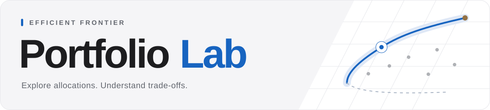
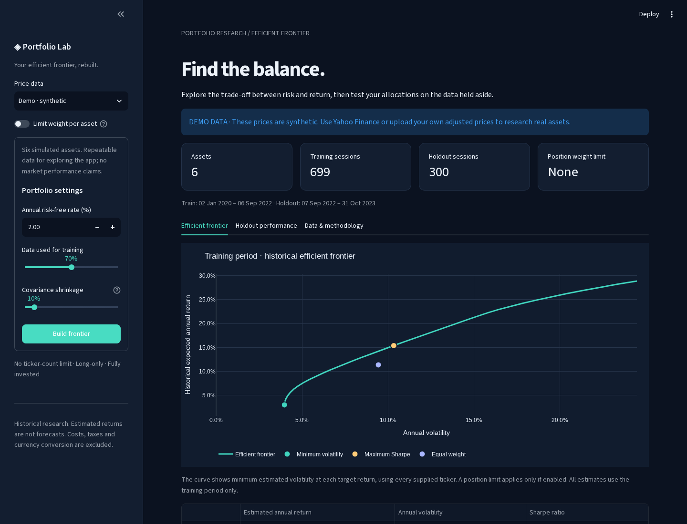

[](https://github.com/sammcentee/efficientfrontier/actions/workflows/ci.yml)

A local research app for portfolio allocations, risk, and historical tests. Start with the current Nasdaq-100, your own tickers, a price CSV, or the offline synthetic demo.

Compare Low, Medium, and Highest model portfolios. Inspect every weight, evaluate allocation rules against SPY and QQQ, and export an interactive report. This is a research tool, not an investment recommendation or a trading system.

## Start here: no coding needed

1. Install **Python 3.14** from the official [Windows](https://www.python.org/downloads/windows/) or [macOS](https://www.python.org/downloads/macos/) page. Linux needs Python 3.14 with `venv` support.
2. [Download the ZIP](https://github.com/sammcentee/efficientfrontier/archive/refs/heads/main.zip) and extract the whole folder.
3. Open the launcher for your computer:

| Computer | Launcher |
| --- | --- |
| Windows | Double-click `Start Portfolio Lab.bat`. |
| macOS | Double-click `Start Portfolio Lab.command`. |
| Linux or WSL | Run `bash run.sh` from the extracted folder. |

The first launch installs the packages and needs internet access. Later launches reuse the local `.venv`. A browser tab opens at **http://localhost:8501**. Keep the launcher window open. Press **Ctrl+C** there to stop the app.

For setup errors, ports, and remote sessions, see the [user guide](docs/USER_GUIDE.md#setup-and-troubleshooting). Python 3.14 is the tested version. Native Windows startup has a smoke check. macOS startup still needs a check on a Mac.

For a terminal setup:

```bash
git clone https://github.com/sammcentee/efficientfrontier.git
cd efficientfrontier
bash run.sh
```

## Your first study

1. Keep **Nasdaq-100** and **5 years**, or select **Change** for your own data.
2. Select **Show portfolios**. The app obtains prices, fits the portfolios, and runs the historical market test.
3. Choose **Low**, **Medium**, or **Highest**. Open **Every stock and its exact weight** for the full allocation.
4. Open **“Would this rule have beaten the market?”** Choose a **Rule**. **Test settings** changes the trade assumptions.
5. Open **Research** for frontiers, risk, data coverage, all tests, and the method.
6. Select **Export** for the report and data. The report includes the results on screen.

The app waits for **Show portfolios** before it requests data. Select **Try the offline demo** for a synthetic example without a data download. CSV analysis also works offline after setup.

Keyboard shortcuts: **Ctrl+Enter** on Windows/Linux or **Cmd+Enter** on macOS submits the setup. **L/M/H** selects a profile, **2** opens the market test, **4** opens Research, and **E** exports. See the [user guide](docs/USER_GUIDE.md) for settings and input rules.



*Screenshot from an earlier app version. The current layout can differ.*

## What the profiles mean

The latest model uses all supplied history, split into three chronological windows. It optimizes annualized arithmetic mean return in the weakest window, subject to covariance risk and the chosen weight limit.

| Profile | Meaning within this model |
| --- | --- |
| Low | Minimum estimated volatility. |
| Medium | Halfway between the Low and Highest weakest-window return targets. |
| Highest | Highest achievable weakest-window mean return, with minimum variance among tied solutions. |

These are relative model positions. Low can still contain risky assets, and profiles can coincide. Highest does not use leverage. CSV and JSON exports retain the name **Extreme** for Highest.

**Latest holdings are an in-sample fit, not a forecast.** The fit date is the last supplied price date. Separate backtests fit targets with only data before each trade. They evaluate the allocation rule, rather than today's weights. See [profile construction and evaluation](docs/BACKTESTING.md#latest-model-holdings-and-profiles).

## The full Nasdaq-100 universe

The default requests the [current official constituent list](https://api.nasdaq.com/api/quote/list-type/nasdaq100), with separate share classes. It admits only securities with complete positive adjusted prices on the fixed SPY/QQQ market dates for the selected history.

It records exclusions. It does not fill gaps or shorten the common history. Open **Research → Data** for counts and reasons. Reports retain `universe_coverage.csv` and the source date. An unavailable or incomplete constituent list stops the request.

Every eligible asset enters the optimization. Weights can be zero. There is no fixed ticker-count or holdings-count cap, though large inputs need more time and memory. The full weight table and exports retain every asset.

**This is historical analysis of current members.** It does not reconstruct past index membership. Current membership and complete-history eligibility introduce selection bias. A shorter history can admit more assets and also changes the estimation sample.

## Your own prices

Select **Change → Upload CSV**. Put `Date` first, followed by one column per asset:

```csv
Date,ASSET_A,ASSET_B
2023-01-03,100.00,80.00
2023-01-04,101.00,79.50
2023-01-05,100.50,80.10
2023-01-06,102.00,80.40
2023-01-09,101.80,81.00
2023-01-10,102.10,80.70
2023-01-11,101.90,81.20
```

Use complete positive adjusted prices in one currency. The app does not convert currencies or fill missing prices. Set **Change → Model assumptions → Price frequency** to match the file. Annualization does not resample the data.

The classic analysis needs at least five price rows and a split with two returns in each period. Latest profiles need seven rows. See the [price-data rules](docs/USER_GUIDE.md#price-data) for short histories, exchange suffixes, and benchmarks.

## Reports without the browser

After the launcher creates `.venv`, run these commands from the repository root:

```bash
# Offline synthetic study with all four backtest rules
.venv/bin/python -m efficient_frontier --backtests

# Current Nasdaq-100 members with complete history from the chosen start
.venv/bin/python -m efficient_frontier --nasdaq100 --start 2021-01-01 --backtests

# Your price file, with no benchmark download
.venv/bin/python -m efficient_frontier --csv data/prices.csv --backtests
```

On Windows, use `.venv\Scripts\python.exe` instead of `.venv/bin/python`. The default output is `results/latest/`. Open `report.html` for the offline report, or choose **Print / save PDF** in it. The ZIP includes the input prices and full results.

A rerun replaces generated files in that destination. Use a separate `--output` folder to preserve a study. Keep private inputs in ignored `data/` or `private/` folders. Review reports before you share them. See [CLI options and exports](docs/USER_GUIDE.md#command-line-options-and-exports).

## Historical findings and limits

The [recorded 60-stock study](docs/HOLDINGS_STUDY.md) evaluated 2023-05-17 through 2026-10-02, with 10-basis-point fees on bought and sold amounts. Fixed maximum Sharpe returned **256.75%** with heavy concentration. LLY's weight reached **63.48%**. Rolling maximum Sharpe had a smaller drawdown and more trades. Its advantage over equal weight fell to **0.68 percentage points** in the later-period check.

That study used a list recorded after the main evaluation began. It includes selection hindsight and does not establish future returns or statistically supported outperformance against SPY or QQQ. The linked study retains dates, fees, holdings, reproduction steps, and limitations.

Current benchmark comparisons use matched dates and entry rules. They account for all strategy/benchmark tests in the run. Neither a headline return nor a p-value gives the probability of future success. Results omit taxes, FX conversion, and real execution limits. See the [benchmark guide](docs/BENCHMARKS.md).

## Documentation and development

| Guide | Contents |
| --- | --- |
| [User guide](docs/USER_GUIDE.md) | Setup, settings, input rules, CLI options, and reports. |
| [Backtests and methods](docs/BACKTESTING.md) | Profile objectives, trade timing, fees, metrics, and risk. |
| [Market benchmarks](docs/BENCHMARKS.md) | SPY/QQQ data, matched comparisons, and statistical limits. |
| [Historical stock study](docs/HOLDINGS_STUDY.md) | Recorded findings and reproduction steps. |
| [Optimizer capacity](docs/PERFORMANCE.md) | Measured time and memory, with reproduction commands. |
| [Validation record](docs/VALIDATION.md) | Dated checks and their limits. |
| [Repository review](docs/REVIEW.md) | Findings, fixes, and remaining priorities from 9–10 October 2026. |
| [Contributing](CONTRIBUTING.md) | Development setup and review process. |

```bash
.venv/bin/python -m pip install -r requirements-dev.txt
.venv/bin/python -m pip check
.venv/bin/python -m pytest -q
```

CI runs the automated checks and an offline CLI export. Provider responses are mocked in automated tests. Browser and live-data checks are separate and do not establish physical-phone support.

The app uses Python, CVXPY, and the compiled Rust Clarabel solver. The original `Efficient Frontier v1.12.R` and `spy_holdings.ods` remain historical files. R is not required.

## License and data access

Original code and documentation use the [MIT License](LICENSE). Third-party software and data retain their own terms. See [third-party notices](THIRD_PARTY_NOTICES.md), the dated [public-source review](docs/PUBLIC_RELEASE_REVIEW.md), and [security reporting](SECURITY.md).

Yahoo access through yfinance is unofficial. A software license does not grant data-access or redistribution rights. Use the integration only where your access and intended use are authorized. Keep downloaded market prices and reports local unless redistribution is permitted.
